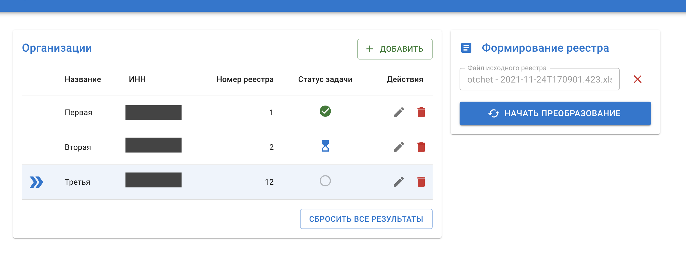
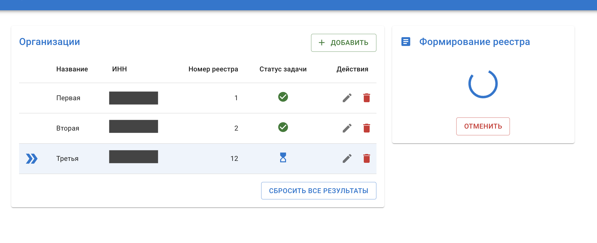
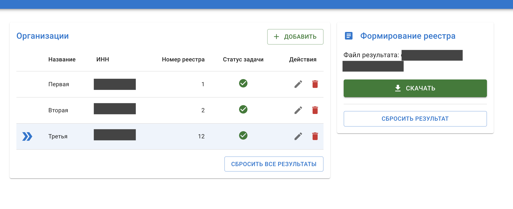

# Reg2Reg - преобразование отчетов в файл для фискализации чеков.

## Ссылка на сервис - [https://semenov-k.github.io/reg2reg/](https://semenov-k.github.io/reg2reg/)

- Поддерживание создание и управление ораганизациями.
- Использует webworker'ы для распределения работ.
- Использует асинхронный подход к формированию файлов.
- Работает локально, в браузере.

## Скриншоты

